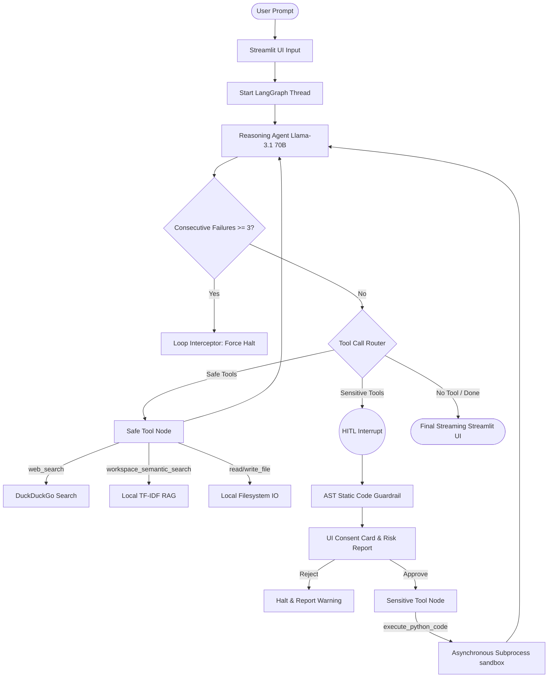

# 🌌 NexusGraph: Stateful Multi-Agent AI Engine with Enterprise Security Guardrails

NexusGraph is an advanced, production-grade autonomous multi-agent conversational engine built using **LangGraph**, **LangChain**, and **Streamlit**. It acts as an autonomous assistant capable of browsing the web, managing and modifying local workspace files, and executing arbitrary Python code—all orchestrated through stateful thread memory, real-time observability telemetry, and safety-focused security guardrails.

---

## 🚀 Key Architectural Highlights (Resume Showcase)

*   **Stateful Multi-Agent Orchestration**: Built using a cyclical StateGraph framework via `LangGraph`, managing sequential and parallel routing between reasoning nodes, safe tools, and restricted code execution environments.
*   **Asynchronous Subprocess Executor**: Fully engineered using Python's **`asyncio.create_subprocess_exec`** non-blocking process manager. Highly heavy scripts run completely in the background without locking or freezing the Streamlit UI event loops.
*   **Infinite Loop Cost Protection**: Integrated a `consecutive_errors` counter directly in the `AgentState` schema. If the LLM gets trapped in an infinite error-correction cycle, the system's **Loop Interceptor Guardrail** automatically halts the thread after **3 consecutive tool failures**, safeguarding context windows and API balances.
*   **Static AST Security Guardrails**: Outfitted with an AST (Abstract Syntax Tree) Static Code Analysis Engine. Before any generated code runs, it parses the script, scanning for dynamic imports (`__import__`), reflection (`getattr`, `setattr`), dynamic evaluations (`eval`, `exec`), and dangerous modules (`subprocess`, `os`, `sys`), generating a comprehensive threat warning and Risk Profile.
*   **Dynamic Local Workspace RAG**: Developed a vectorless TF-IDF cosine-similarity semantic search engine that indexes and retrieves matching snippets from local scripts, config files, and markdown documents on the fly.
*   **Human-In-The-Loop (HITL) Interceptor**: Implemented runtime state-freezing checkpointers (`MemorySaver`). Whenever a sensitive sandbox command is proposed, the execution path pauses, demanding manual approval or rejection of the AST-audited task.
*   **Real-time Observability Telemetry**: Tracks token-level streaming utilizing `astream_events` alongside system latency tracking to provide performance observability logs directly in the main metrics dashboard.

---

## 🛠️ Technology Stack

*   **Agentic Framework**: LangGraph, LangChain Core, LangChain Community
*   **Large Language Model**: Meta-Llama-3.1-70B-Instruct (via OpenRouter stream API)
*   **Concurrency**: Asynchronous Python (`asyncio`)
*   **Security & Guardrails**: Python AST (Abstract Syntax Tree) Parsing + Ephemeral Sandboxing
*   **Retrieval System (RAG)**: Pure Python TF-IDF Semantic Cosine Similarity Search
*   **Frontend UI/UX**: Streamlit (with fully customized, dark glassmorphic CSS overlays)
*   **Environment Management**: Dotenv, UV Package Manager

---

## 📐 System Architecture Flowchart



---

## 🔒 Enterprise Security & Sandbox Strategy
While the Static AST Guardrail analyzes scripts for reflections, dynamic imports, and evaluation tricks, it serves as a lightning-fast, zero-cost pre-filtering gate.

In production deployments, code is securely routed to run inside **isolated, ephemeral Docker containers (e.g., local Docker nodes or AWS ECS micro-VMs)** configured with:
*   Strict CPU/memory limits to prevent resource leaks.
*   Read-only root directory mappings.
*   Zero network adapter access.
*   A strict 15.0 second subprocess timeout limit.

---

## ⚙️ Quick Start Installation

1. **Clone the Repository**:
   ```bash
   git clone <your-repository-url>
   cd nexusgraph
   ```

2. **Set Up the Virtual Environment**:
   It is recommended to use the lightning-fast `uv` package manager:
   ```bash
   uv venv
   .venv\Scripts\activate
   uv pip install -r requirements.txt
   ```

3. **Configure Environment Variables**:
   Create a `.env` file in the root directory:
   ```env
   OPENROUTER_API_KEY=your_openrouter_api_key_here
   ```

4. **Launch the Engine**:
   ```bash
   streamlit run app.py
   ```
