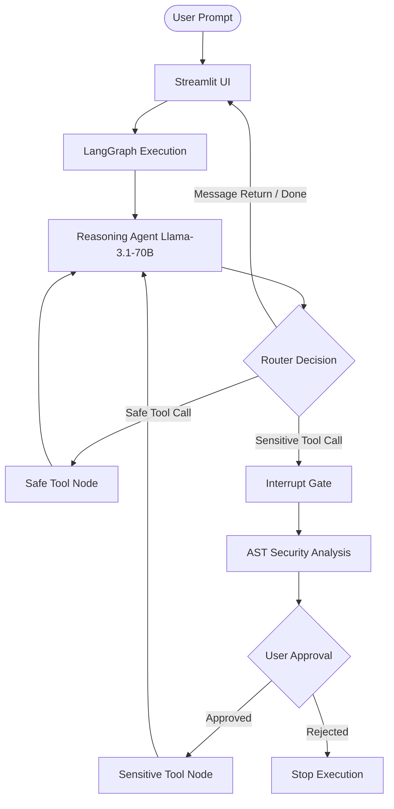

# 🌌 NexusGraph: Architecture & Implementation Blueprint for AI Agents

This document provides a highly structured, prompt-ready guide detailing the exact operational flow and code blueprints of **NexusGraph**. Any advanced AI code generation model can ingest this document to replicate the exact system from scratch.

---

## 📐 1. System Topology & Operational Flow

NexusGraph is an autonomous multi-agent chatbot built on a **Stateful Cyclical Graph (LangGraph)** with a **Human-In-The-Loop (HITL) interrupt gate**, a **Static AST Code Security Guardrail**, and a **Local Semantic RAG**.



---

## 🛠️ 2. File-by-File Blueprint

### 🗂️ File 1: `state.py` (Shared Graph Memory Schema)
*   **Role**: Defines the data structure (state) that accumulates facts and passes messages across nodes in the cyclical graph.
*   **Blueprint**:
    ```python
    from typing import Annotated, TypedDict
    from langchain_core.messages import AnyMessage
    from langgraph.graph.message import add_messages

    class AgentState(TypedDict):
        # Accumulated thread messages. add_messages appends new messages automatically.
        messages: Annotated[list[AnyMessage], add_messages]
        # Tracks current node sender for logging
        sender: str
    ```

---

### 🛠️ File 2: `tools.py` (Vulnerability Parser & Local TF-IDF Search)
*   **Role**: Contains the tool logic, including the custom math-based search and the security checker.
*   **Key Implementations**:
    1.  **`analyze_code_safety(code: str) -> dict`**:
        - Parses code using Python's native `ast.parse()`.
        - Traverses the tree (`ast.walk`) to inspect `Import`, `ImportFrom`, and `Call` nodes.
        - Identifies suspect modules (`os`, `subprocess`, `sys`, `shutil`, `requests`, `socket`).
        - Assigns threat scores (e.g., call to `system()` adds 45 points) and flags findings.
    2.  **`workspace_semantic_search(query: str) -> str`**:
        - Recursively scans workspace files (ignoring `.venv`, `__pycache__`, etc.).
        - Implements a pure-Python, zero-dependency TF-IDF system:
          - Tokenizes doc texts and calculates term frequencies.
          - Calculates inverse document frequencies ($IDF = \ln((1+N)/(1+DF)) + 1$).
          - Computes cosine similarity of vectors to match the top 3 snippets.
    3.  **`execute_python_code(code: str) -> str`**:
        - Runs the code using `subprocess.run(["python", "-c", code])` with a 15-second timeout.
*   **Exported Lists**:
    - `safe_tools = [web_search, read_file, write_file, workspace_semantic_search]`
    - `sensitive_tools = [execute_python_code]`

---

### ⛓️ File 3: `graph.py` (StateGraph Orchestration & Interrupt Gate)
*   **Role**: Compiles the nodes, defines the cyclical conditional transitions, and implements the checkpointer interrupt.
*   **Key Implementations**:
    1.  **`reasoning_agent`**:
        - Invokes LLM (`llm.bind_tools(safe_tools + sensitive_tools)`) bound with custom system prompts guiding tool choices.
    2.  **`route_tools(state)`**:
        - Inspects the LLM's last message.
        - If `tool_calls` exists, checks if any called tool resides in `sensitive_tools`. If yes, returns `"sensitive_tools"`, else `"safe_tools"`. If no tool calls, ends execution (`"__end__"`).
    3.  **Graph Compilation**:
        ```python
        workflow = StateGraph(AgentState)
        workflow.add_node("reasoning_agent", reasoning_agent)
        workflow.add_node("safe_tools", ToolNode(safe_tools))
        workflow.add_node("sensitive_tools", ToolNode(sensitive_tools))
        
        workflow.add_edge(START, "reasoning_agent")
        workflow.add_conditional_edges("reasoning_agent", route_tools, {
            "safe_tools": "safe_tools",
            "sensitive_tools": "sensitive_tools",
            "__end__": END
        })
        workflow.add_edge("safe_tools", "reasoning_agent")
        workflow.add_edge("sensitive_tools", "reasoning_agent")
        
        # KEY RESUME FEATURE: Interrupt execution prior to hitting the sensitive node
        memory = MemorySaver()
        graph = workflow.compile(checkpointer=memory, interrupt_before=["sensitive_tools"])
        ```

---

### 🖥️ File 4: `app.py` (Streamlit Async Event Streamer & Telemetry)
*   **Role**: Provides a gorgeous, minimal frontend interface, tracks latency telemetry, handles clicks for prompt suggestions, and presents the security report.
*   **Key Implementations**:
    1.  **Asynchronous Streaming Handler (`process_stream`)**:
        - Uses `astream_events(..., version="v2")` to listen for LLM events.
        - Hooks `on_chat_model_stream` to stream output text token-by-token using `st.empty()`.
        - Tracks stream latency: `time.time() - start_time`.
        - Synchronizes frontend chat history with the checkpointer (`graph.get_state(config)`).
    2.  **Human-In-The-Loop Panel**:
        - Checks `graph.get_state(config)`. If `current_state.next` targets `"sensitive_tools"`, freezes the user interface.
        - Extracts the pending python code, passes it into `analyze_code_safety(code)`, and displays a detailed security analysis grid (risk score, vulnerability checklist).
        - Renders approval approval buttons. If **Approve** is clicked, resumes execution by calling `process_stream(None, config)`.
    3.  **Interactive Suggestion Grid**:
        - If chat history is empty, renders interactive card buttons. Clicking a card sets `st.session_state.pending_prompt`, triggers an auto-rerun, and streams the execution.

---

## 📈 3. Key Concepts to Teach a Building AI
When asking another AI model to build this, paste this prompt:
> "Construct a stateful multi-agent orchestrator in python. Compile the graph using LangGraph with a memory checkpointer and define an interrupt gate before a sensitive command execution node. Implement static AST checking to parse the generated Python code prior to execution to audit modules and dangerous calls, displaying a complete risk profile (risk score, security findings). Create an asynchronous token-level stream handler using streamlit, displaying dynamic telemetry metrics and prompt suggestions that automatically fill and run the engine on click."
